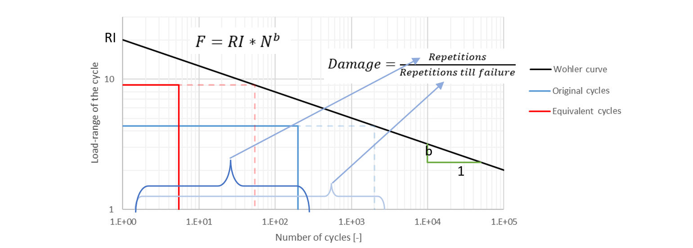

# Durability Signal Processing

[Click here to try it now](https://galuszkm.github.io/RPC3/)!

## Overview

In the automotive industry, understanding and predicting fatigue is critical for designing durable components. Durability Signal Processing is a web-based tool designed to analyze and reduce raw measurement signals — collected during vehicle ridework — into a shorter representation that preserves the "potential damage" information. This potential damage is a key indicator used in fatigue analysis to assess how repeated loadings might eventually lead to component failure.

## What It Does

- **Intelligent Signal Reduction:**  
  The tool compresses extensive time-series data into a simplified signal. Despite the reduction, it maintains critical fatigue indicators so that the inherent potential damage is not lost.

- **Fatigue Analysis Support:**  
  By preserving potential damage, the app enables engineers to perform robust fatigue evaluations. This makes it possible to predict the lifespan of components based on actual measured loading conditions.

- **Streamlined Workflow:**  
  Traditional fatigue analysis tools often require labor-intensive manual processing. This app automates repetitive tasks, allowing for efficient data handling, analysis, and reporting—all within an intuitive, client-side interface.

## Why It Matters

Automotive durability testing generates vast amounts of data, and conventional tools like nCode, while powerful, may not always offer the straightforward automation needed for routine processing tasks. With Durability Signal Processing, engineers can quickly reduce and analyze ridework signals to focus on what matters most: accurately capturing the factors that lead to fatigue damage. This ensures that essential data is preserved for further analysis, ultimately supporting safer and more reliable vehicle designs.

## Equivalent damage based test proposal

This methods aims to propose simplified test in such way that the potential damage of both signals is the same. This approach allows for advanced manipulation of the cycles (replacing many low cycles with few high ones), which allows to significantly reduce the testing time. However this comes at a cost of requiring strictly linear relationship between external load and stress.

Equivalent test proposal procedure consist of following steps:
1.	Splitting random signal (road load data) into separate cycles. This is performed by rain-flow counting algorithm. This step results in list of cycles where each cycle has load-range (max-min) and load-mean value ( (max+min)/2 ). This step is performed by algorithm embedded in nCode software and therefore it is not described in this report.
2. Grouping similar cycles into one block
3. Damage recalculation – this part is performed to define equivalent block’s load-range and repetitions.
4. Defining mean value of equivalent blocks
5. Grouping cycles into one block - This part is performed with the use of cumulative damage graph. All the cycles from rain-flow counting algorithm (blue) are ordered by decreasing load-range. On the X-axis, percentage damages from each cycle are staked one after another. This graph allows to distribute the equivalent blocks (red) in such way that the damage from equivalent blocks cover  as much as possible the damage from the original signal (this is to avoid excessive damage recalculation in next step). In practice the aim is to minimize the gray/dashed area.   
    

6. Damage recalculation - The goal of damage recalculation is to define representative load-range and how many times equivalent block should be repeated in order to correctly recreate the damage of the block. Core principal of damage recalculation is the idea that we can replace couple of cycles (of certain load-range) with cycles of different load-range as long as the resulting damage is the same. This is performed according to Miner’s rule (illustrated by the example below). Following rules are observed during load-range selection for equivalent blocks:
    - First block (the highest load-range) is always defined in such way that load-range of this signal is the same as load-range from the entire signal.
    - Load-ranges of subsequent blocks are established in such way that the total number of cycles from all the equivalent blocks is not lower than 2e5.

    Example – Damage recalculation
    Let’s consider cycle with load-range of 4.37kN. Based on the Wohler curve given below we know that it takes 2000 repetition to destroy the part. But if we repeat this cycle only  200 times, this means that the resulting damage is equal to 0.1. Now we can reproduce this damage with some other cycle. For example if we have cycle of 9kN load-range we would normally need to repeat it 54.2 times to destroy the part. However if we apply 5.42 repetitions, we obtain again the damage of 0.1, hence we can replace 200 cycles of 4.37kN load-range with 5.42 repetitions of 9kN load-range cycle.

    

        where: 
            RI – load-range intercept, 
            N – number of cycles till damage, 
            b- Wohler slope, 
            RI – Range Intercept

    > **&#9432; Note:**
    > For damage comparison purposes, only slope of the Wohler curve is relevant, range intercept does not influence the comparison between two cycles. Therefore, for damage recalculation purposes, range intercept is always assumed as 1. This results in situation where damage values have no physical interpretation (can be used only for comparison). In such case following equation can be used:

    where:
        m – Wohler curve slope defined as reciprocal of b value from previous graph
        n – number of cycles
           
 

   > **&#9432; Note:**
   > Practical experience show [1] that when random loading is applied mechanical structures undergo fatigue failure earlier than when only one or two sine signal amplitudes are applied. For this reason, it is recommended to assume that he Miner summation at failure is 0.8 (instead of 1). This results in the safety factor of 1.2 applied on the cycle count of the equivalent signal.

7. Defining mean of the equivalent block - Mean of each equivalent block is established by calculating average value of the mean across all the cycles within given equivalent block. However this approach can result in maximum or minimum value of block, exceeding overall maximum or minimum values of the original signal. In such case, mean value of the equivalent block is corrected so all the blocks are within the bounds of the original signal.

#### Recommended Wohler (S-N) curve slopes
As described in the previous paragraph, for the comparison purposes the slope of the Wohler curve is important. In order to standardize the processing, Wohler sloped provided in the Table 1 are recommended.

| Material                         | Wohler slope | Sources    |
| -------------------------------- | ------------ | ---------- |
| Steel                            | 5            | [2]        |
| Aluminum                         | 10           | [3]        |
| Rubber                           | 5            | [4]        |
| Glass fiber reinforced polyamide | 5            | [5], [6]   |
| Welds                            | 3            | [Eurocode] |

## Developer Notes

For more details on the file format used in this project, please refer to the RPC-III file format description [here](public/RPC3_Format.pdf).

## Sources
[1] A. F. Hobbacher, Recommendations for Fatigue Design of Welded Joints and Components. in IIW Collection. Cham: Springer International Publishing, 2016. doi: 10.1007/978-3-319-23757-2.

[2]	“MMPDS Handbook.” 2019.

[3]	D. Häfele, “STZ Bauteilfestigkeit und -sicherheit, Werkstoff- und Fügetechnik an der Hochschule Esslingen,” 2013.

[4]	A. N. Gent, Ed., Engineering with rubber: how to design rubber components, 3rd ed. Munich ; Cincinnati: Hanser Publishers, 2012.

[5]	“Effects of time and temperature conditions on the tensile-tensile fatigue behavior of short fiber reinforced polyamides.” BASF Corporation, 2003.

[6]	Mechanical Modeling and Manufacturing Laboratory (LA2MP), National Engineering School of Sfax, University of Sfax, B.P W3038, Sfax, Tunisia et al., “Fatigue Behavior of Short Glass Fiber Reinforced Polyamide 66: Experimental Study and Fatigue Damage Modelling,” Period. Polytech. Mech. Eng., vol. 60, no. 4, pp. 247–255, Sep. 2016, doi: 10.3311/PPme.9054.
